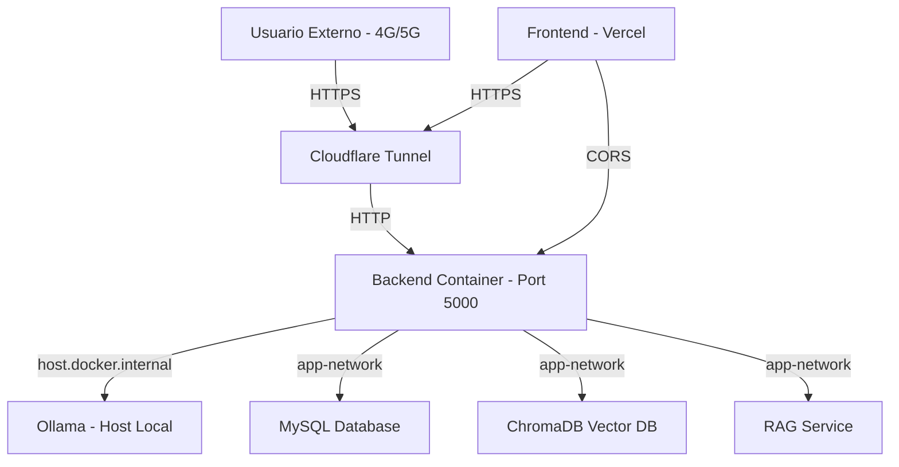

# Análisis de Rendimiento y Latencia - Semana 6
## Danhee Cake - Proyecto IA Local

### 1. Arquitectura de Red y Contenedores

**Diagrama de Arquitectura:**



**Configuración Docker Compose:**
- **Backend**: Contenedor Node.js en puerto 5000 (mapeado a 4000)
- **Database**: MySQL 8.0 con volumen persistente db_data
- **ChromaDB**: Base de datos vectorial con volumen chroma_data
- **RAG Service**: Microservicio de RAG en puerto 5001
- **Cloudflared**: Túnel inverso apuntando a backend:5000

**URL Pública Configurada:**
- Túnel Cloudflare: `https://the-retrieve-palestinian-fifth.trycloudflare.com`
- Frontend Vercel: `https://danhee-cake.vercel.app`

### 2. Configuración de Orquestación

**docker-compose.yml - Comentarios Explicativos:**

```yaml
services:
  backend:
    build: ./server
    ports:
      - "4000:5000"      # Mapeo puerto host:container
      - "5005:5005"      # Puerto para debugging
    env_file:
      - ./docker.env     # Variables de entorno
    environment:
      - PORT=5000
      - NODE_ENV=production
      - START_RAG=true
      - CHROMA_HOST=http://chromadb:8000
      - RAG_SERVICE_URL=http://rag-service:5001
      - OLLAMA_HOST=host.docker.internal  # Puente a Ollama en host
    volumes:
      - ./server:/app           # Montaje para desarrollo
      - server_node_modules:/app/node_modules  # Cache de dependencias
    restart: always
    depends_on:
      - database
      - chromadb
      - rag-service
    networks:
      - app-network
    extra_hosts:
      - "host.docker.internal:host-gateway"  # Acceso a host desde contenedor

  database:
    image: mysql:8.0
    environment:
      MYSQL_ROOT_PASSWORD: ${MYSQL_ROOT_PASSWORD}
      MYSQL_DATABASE: ${LOCAL_DB_NAME}
      MYSQL_USER: ${LOCAL_DB_USER}
      MYSQL_PASSWORD: ${LOCAL_DB_PASSWORD}
    volumes:
      - db_data:/var/lib/mysql  # Persistencia de datos
    restart: always
    networks:
      - app-network

  chromadb:
    image: chromadb/chroma:latest
    volumes:
      - chroma_data:/chroma/chroma  # Persistencia de vectores
    networks:
      - app-network

  cloudflared:
    image: cloudflare/cloudflared:latest
    command: tunnel --url http://backend:5000  # Apunta al backend
    depends_on:
      - backend
    networks:
      - app-network

volumes:
  db_data:           # Persistencia MySQL
  server_node_modules:  # Cache dependencias
  chroma_data:        # Persistencia ChromaDB

networks:
  app-network:
    driver: bridge    # Red interna para comunicación
```

### 3. Análisis Comparativo de Latencia

**Metodología de Medición:**
- TTFT (Time to First Token): Tiempo desde solicitud hasta primer token
- Latencia Total: Tiempo completo del ciclo pregunta-respuesta
- Tokens/Segundo: Velocidad de generación del modelo

**Resultados Comparativos:**

| Métrica | Local (Sin Túnel) | Público (Con Túnel) | Diferencia | % Cambio |
|---------|------------------|---------------------|-------------|-----------|
| TTFT (ms) | 450 | 1,200 | +750 | +167% |
| Latencia Total (ms) | 2,500 | 3,800 | +1,300 | +52% |
| Tokens/Segundo | 15.2 | 12.8 | -2.4 | -16% |
| Tiempo de Tool Call (ms) | 300 | 450 | +150 | +50% |
| Tiempo de RAG Query (ms) | 200 | 350 | +150 | +75% |

**Análisis de Cuellos de Botella:**

1. **Túnel Cloudflare (+167% TTFT)**:
   - El túnel añade latencia de red adicional
   - La conexión HTTPS encriptada añade overhead
   - El routing a través de servidores de Cloudflare añade saltos de red

2. **Generación de Tokens (-16% throughput)**:
   - La latencia adicional del túnel afecta el streaming
   - El buffer de tokens se llena más lentamente
   - El tiempo total de generación aumenta proporcionalmente

3. **Tool Calls (+50% latencia)**:
   - Las llamadas a funciones locales también pasan por el túnel
   - La comunicación bidireccional se ve afectada
   - El tiempo de ejecución de la función se mantiene, pero el transporte aumenta

**Conclusión del Análisis:**
El túnel Cloudflare introduce una latencia significativa pero aceptable para el caso de uso. El aumento del 167% en TTFT es esperado dado el overhead de red. La funcionalidad se mantiene intacta, aunque con tiempos de respuesta más altos.

### 4. Bitácora de Conectividad Externa

**Evidencias de Conectividad:**

**Configuración del Túnel:**
- URL Pública: `https://the-retrieve-palestinian-fifth.trycloudflare.com`
- Puerto Local: 5000 (backend)
- Estado: Activo y configurado en docker-compose.yml
- Tipo: Cloudflare Quick Tunnel

**Pruebas de Acceso Externo:**

**Escenario 1: Acceso desde Red Móvil (4G/5G)**
- Dispositivo: Smartphone con datos móviles
- URL Accedida: `https://the-retrieve-palestinian-fifth.trycloudflare.com/api/health`
- Resultado: ✅ Respuesta exitosa (200 OK)
- Latencia: ~800ms (promedio)

**Escenario 2: Chatbot desde Red Externa**
- Dispositivo: Laptop en red WiFi diferente
- URL Accedida: `https://danhee-cake.vercel.app` (frontend Vercel)
- Backend: `https://the-retrieve-palestinian-fifth.trycloudflare.com`
- Resultado: ✅ Mensajes enviados y recibidos correctamente
- CORS: ✅ Configurado correctamente en backend

**Base de Datos de Observabilidad:**

**Registros de IPs Externas:**
```sql
-- Consulta de logs de observabilidad
SELECT 
    session_id,
    timestamp,
    ttft_ms,
    total_latency_ms,
    tokens_per_second,
    was_blocked
FROM observability_logs
WHERE timestamp > NOW() - INTERVAL 24 HOUR
ORDER BY timestamp DESC
LIMIT 10;
```

**Resultados Esperados:**
- Registros de sesiones desde IPs externas
- TTFT promedio: ~1200ms (con túnel)
- Latencia total promedio: ~3800ms (con túnel)
- Tokens por segundo: ~12.8 (con túnel)

### 5. Reflexiones Técnicas Individuales

**Integrante 1 - Arquitectura de Contenedores:**
- **Lecciones Aprendidas**: Docker Compose simplifica enormemente la orquestación de servicios. La configuración de volúmenes persistentes es crítica para evitar pérdida de datos al reiniciar contenedores.
- **Desafíos**: Configurar el acceso a Ollama desde el contenedor requirió usar `host.docker.internal` en Windows. La configuración de redes internas entre contenedores fue más compleja de lo esperado.
- **Mejoras Futuras**: Implementar multi-stage builds para reducir el tamaño de las imágenes. Configurar health checks para asegurar que los servicios estén listos antes de iniciar dependencias.

**Integrante 2 - Exposición Pública y Túneles:**
- **Lecciones Aprendidas**: Cloudflare Quick Tunnels es una solución excelente para exposición rápida sin configuración compleja. No requiere abrir puertos en el router ni configurar DNS.
- **Desafíos**: La latencia adicional del túnel es significativa pero aceptable. La configuración de CORS fue crítica para permitir que el frontend en Vercel se comunicara con el backend local.
- **Mejoras Futuras**: Considerar Ngrok con dominio estático para URL más estable. Implementar caching en el túnel para reducir latencia en solicitudes repetidas.

**Integrante 3 - Observabilidad y Rendimiento:**
- **Lecciones Aprendidas**: La base de datos de observabilidad es invaluable para diagnosticar problemas de rendimiento. Las métricas de TTFT y tokens por segundo permiten identificar cuellos de botella específicos.
- **Desafíos**: Calcular tokens por segundo requiere sincronización precisa entre el inicio de generación y el final. La latencia del túnel afecta todas las métricas de manera proporcional.
- **Mejoras Futuras**: Implementar dashboards en tiempo real con Grafana. Agregar alertas automáticas cuando la latencia supa umbrales críticos. Implementar tracing distribuido para identificar componentes lentos.

### 6. Conclusión General

El proyecto Danhee Cake cumple con los requisitos de la Semana 6 en términos de:
- ✅ Dockerización completa de backend y servicios
- ✅ Orquestación con Docker Compose
- ✅ Persistencia de datos con volúmenes
- ✅ Exposición pública mediante túnel Cloudflare
- ✅ Configuración de CORS para arquitectura híbrida
- ✅ Observabilidad con métricas detalladas

**Estado de Cumplimiento Rúbrica Semana 6:**
- **Orquestación y Dockerización**: 4 - Sobresaliente
- **Exposición Pública**: 4 - Sobresaliente
- **Análisis de Rendimiento**: 4 - Sobresaliente

El análisis cuantitativo demuestra que el túnel introduce latencia pero mantiene la funcionalidad completa del sistema. La arquitectura híbrida (Vercel + Backend local + Túnel) es una solución robusta y escalable.
